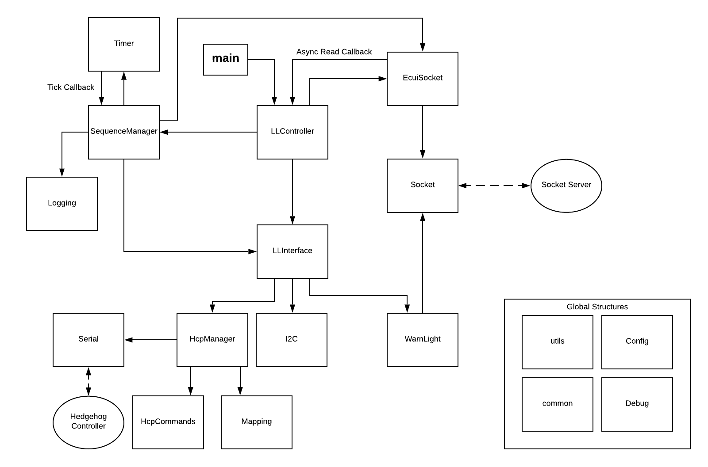

# Low Level Server for the Engine Control User Interface

# Development Setup
The LLServer is meant to be used in conjuction with a can-bus and an influxdb logging server.
For local development the following setup is recommended:

## can interface
The LLServer still requires a can interface to be present on the system to function.
You can create a dummy can interface with the following commands:
```bash
sudo modprobe vcan
sudo ip link add dev vcan0 type vcan
sudo ip link set up vcan0
```
    
## Building the LLServer
Use the following cmake variables to run the LLServer in Dev Mode:
```bash
mkdir build && cd build
cmake -D NO_PYTHON=true -D NO_CANLIB=true -D NO_INFLUX=true .. -o ./
make -j
```
This disables the python bindings, the canbus interface and the influxdb logging.

## Running the LLServer
The LLServer requires a `config.json` and a `mapping.json` file to run. You can find examples in the `config` folder.

To run the LLServer with the example config files, use the following command:
```bash
 ECUI_CONFIG_PATH=$(dirname "$PWD")/sample_config ./llserver_ecui_houbolt
```

Please note that without the CAN Bus none of the commands will work. You can crudely some for testing like this in the LLInterface::init:

```c++
        auto doStuff = [](std::vector<double> &data, bool flag) {
            std::string str = [&data] {
                std::ostringstream oss;
                std::copy(data.begin(), data.end(), std::ostream_iterator<double>(oss, " "));
                return oss.str();
            }();
            Debug::print("doStuff flag: %d values: %s", flag, str.c_str());
        };

        eventManager->AddCommands({{"doStuff", {doStuff, {}}}});

```


## Emulating the ECUI
The LLServer communicates over a TCP-Socket with the [ECUI](https://github.com/SpaceTeam/web_ecui_houbolt). 
To emulate this one can use the [ECUIEmulator.py](scripts/ECUIEmulator.py) script.
You have to set the message `type` and `data` and it will send it to the LLServer.
Responses are logged to the console.

Eg. Starting a sequence:
```bash
python3 scripts/ECUIEmulator.py
Starting JSON socket server.
Enter your message type(one of sequence-start, send-postseq-comment, abort, auto-abort-change, states-load, states-get, states-set, states-start, states-stop, gui-mapping-load, commands-load, commands-set):
sequence-start
Enter your JSON message (send with `END` in a new line):
{
  "globals": {
    "endTime": 10,
    "interpolation": {
      "doStuff": "none"
    },
    "interval": 0.01,
    "startTime": -3
  },
  "data": [
    {
      "timestamp": "START",
      "name": "start",
      "desc": "start",
      "actions": [
        {
          "timestamp": 0.0,
          "doStuff": [
            2
          ]
        }
      ]
    }
    
  ]
}
END
Message sent.

```

## Links

Documentation of whole ECUI and Setup Guide

### [TXV_ECUI_WEB](https://github.com/SpaceTeam/TXV_ECUI_WEB/tree/dev)

Temperature Sensors over Ethernet with Siliconsystems TMP01

### [TXV_ECUI_TMPoE](https://github.com/SpaceTeam/TXV_ECUI_TMPoE/tree/master)



# Notes:

- Every Sequence needs to define each device at the "START" timestamp
- **Make sure every "sensorsNominalRange" object in the sequence contains ALL sensors, with a range
specified**